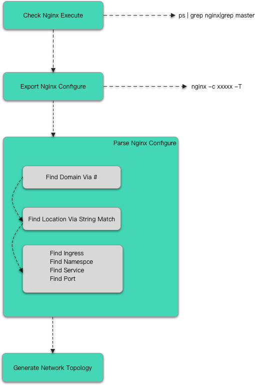

# Kata-Nginx

A tool for observe Nginx topology in Kubernetes 

# How is KN Design?

+ KN first check whether there has a running nginx. 
+ If check success, KN get running nginx configure via `nginx -c <nginx config file> -T`
+ Then KN start parse configure file.
  + All domain in configure starts with '#', so find all domain via string match.
  + Since locations in each server code snippet, so find all location via string match.(Normal, there only has a default location '/')
  + At last, parse ingress name, namespace, service and port info in this location snippet.
+ When KN get all topology info, it fills these data to a struct for client get.

